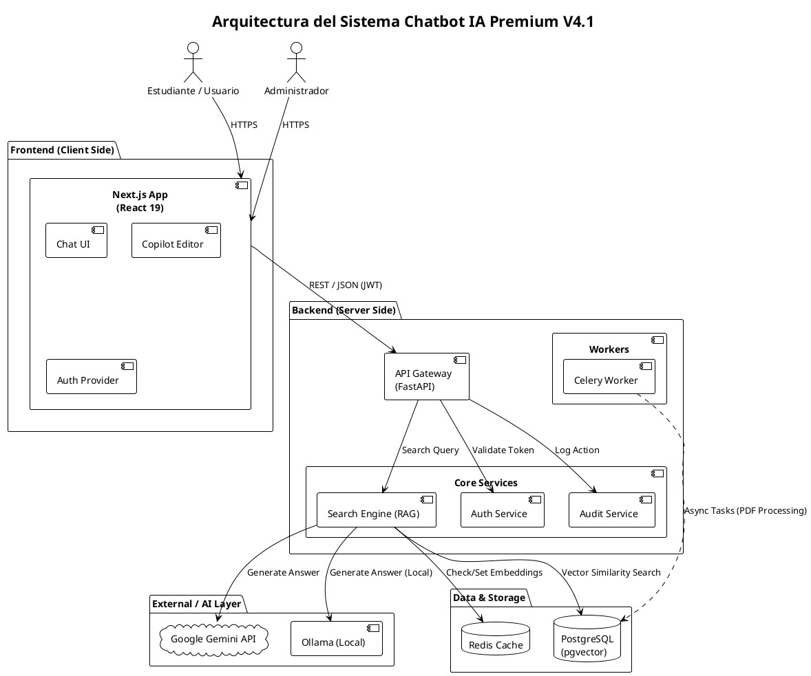
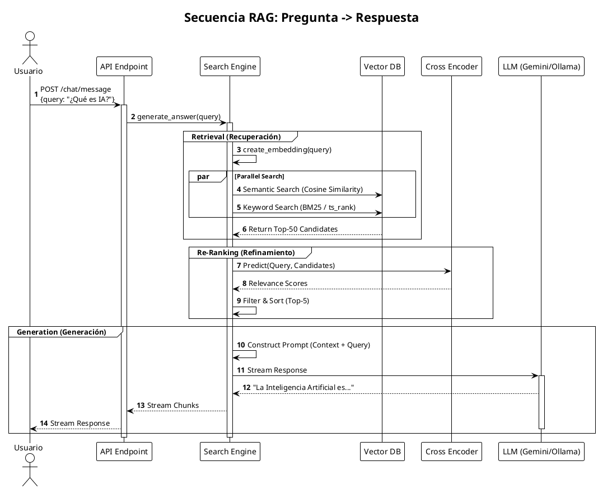
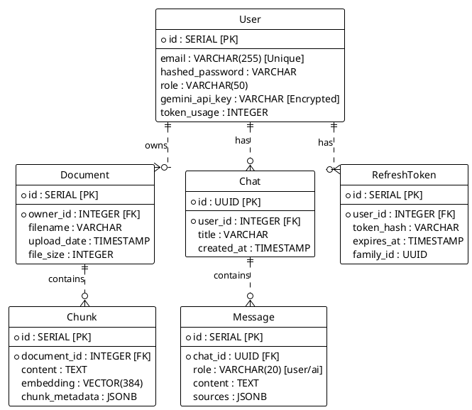
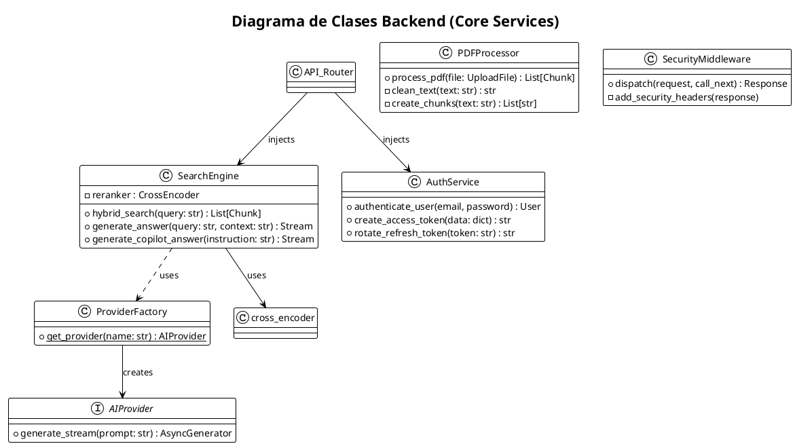

# 🏗️ Documentación de Arquitectura - Chatbot IA Premium V4.1

Esta documentación técnica está diseñada para ayudar a los desarrolladores a entender la estructura, el flujo de datos y el diseño del sistema rápidamente.

> **Nota:** Los diagramas a continuación están escritos en formato **PlantUML**. Puedes renderizarlos usando la extensión "PlantUML" en VS Code o copiando el código en [PlantText](https://www.planttext.com/).

---

## 1. Arquitectura de Alto Nivel (C4 Container)

Describe los contenedores principales y sus interacciones.

---

## 2. Flujo de Datos: RAG Pipeline (Secuencia)

Detalla paso a paso cómo se procesa una pregunta del usuario hasta obtener una respuesta generada.

---

## 3. Modelo de Datos (Entity Relationship)

Esquema de la base de datos PostgreSQL, incluyendo las tablas para usuarios, documentos y vectores.

---

## 4. Diseño de Clases Backend (Simplificado)

Muestra las clases y servicios principales del backend para entender la lógica de negocio.

